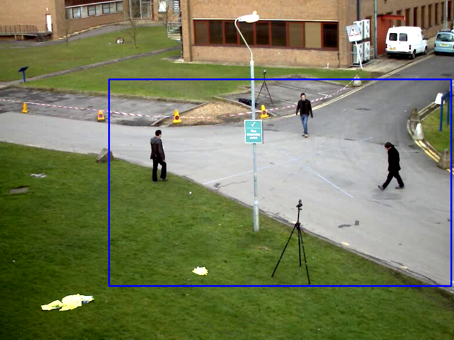
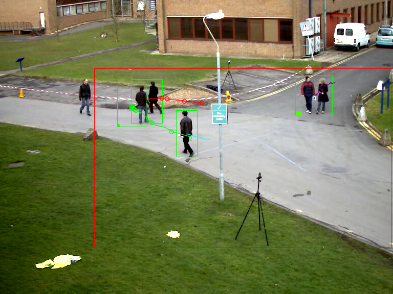
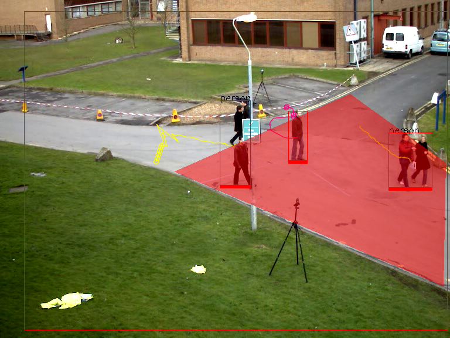
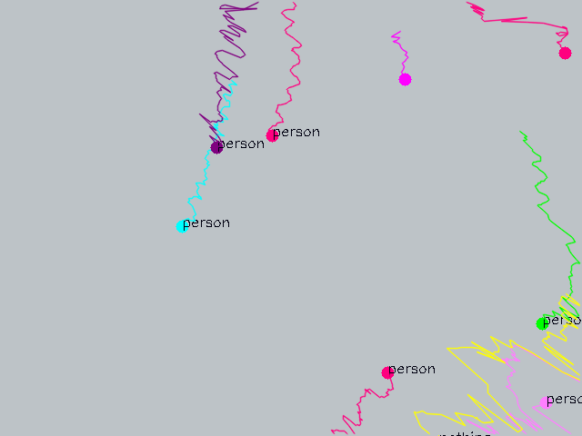

# OBJECT TRACKING 
Author: Kanvaly FADIGA, Yelan MO - Ecole Polytechnique

This repository contain our submission for INF574 - Computer Vision Project. The goal was to code a multiobject tracking systeme and develop ensemble of tools around him to apply him in a specific domain. we choose choose to apply him in surveillance video.

## Dependancies
- We work with OpenCV 4.+
- CMake

## How to run 
Build the source code
```Shell
mkdir build && cd build
cmake ..
make
./ObjectTracking ../data/vtest.avi
```

option:

```
"{ @1             | vtest.avi | Path to a video or a sequence of image }"
"{ out            | out.avi   | Path to output video}"
"{ clf            | false     | with classifyer}"
"{ dtc            | motion    | choose your detector}"
"{ tracker        | CSRT     | choose your tracker}"
"{ all            | true      | track/detect on all windows}"
```

1. **`drag and drop`** to make your selection and type **`Enter`** in th first window that show up. This window ask for section where you want to detect and track moving object. Then a new window will show up below this one.

| Drag and Drop + Enter | Track and Detection windows  | 
|-----------------------|:-----------------------------|
|  |      |

2. **`select 4 points`** to form a polygone. the fifth click will color the zone select and open a windows with the area generated by homography

| 4 point polygon | track in projection space  | 
|-----------------------|:-----------------------------|
|      |      |


NB: 
- if you found it slow change the tracker to MOSSE
- Yolo model and more video for test download them here : [Drive](https://drive.google.com/drive/folders/1tNmK_rk1iTbWm5iOlGGlqx__9RF6EtUj?usp=sharing)

A demo video is available in result folder